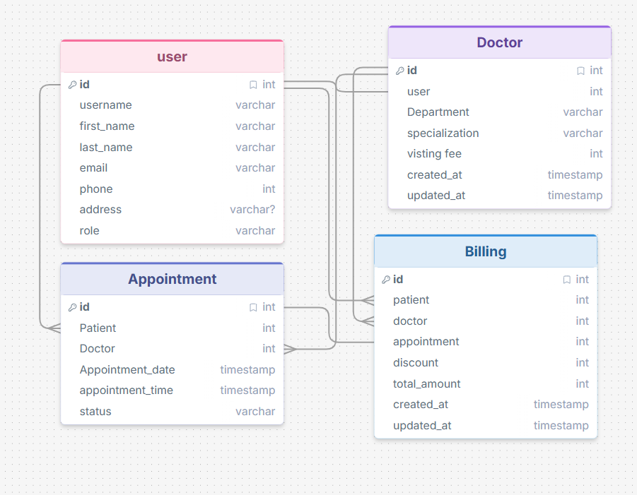

# Hospital Management System API

A simple Django REST Framework based system for a small hospital where patients can register and book appointments, doctors can view their appointments, and admins can manage doctors, appointments, and billing.

## Scenario

A small hospital wants a simple system where:

- Patients can register and book appointments.
- Doctors can view their appointments.
- Admin can manage doctors and appointments.
- The hospital can generate a simple dashboard summary.

## User Roles

- **Admin**
- **Doctor**
- **Patient**

---

## Step by step project details with API end points
<details>
<summary><b>🚀 Click to view full Project Details & API Endpoints</b></summary>

The complete, step-by-step documentation and API endpoint specifications are maintained in the main project file. 

👉 **[View PROJECT_DETAILS.md](./PROJECT_DETAILS.md)**

</details>

---

## ER diagram



## Project Setup Instructions

1. Clone the repository:
   ```bash
   git clone https://github.com/Shuvo018/Hospital-Appointment-Management-System-API-using-Django-REST-Framework.git
   cd Hospital-Appointment-Management-System-API-using-Django-REST-Framework
   ```

2. Create and activate a virtual environment:
   ```bash
   python -m venv venv
   source venv/bin/activate   # On Windows: venv\Scripts\activate
   ```

3. Install required packages:
   ```bash
   pip install -r requirements.txt
   ```

4. Apply migrations:
   ```bash
   python manage.py makemigrations
   python manage.py migrate
   ```

5. Create a superuser (Admin):
   ```bash
   python manage.py createsuperuser
   ```

6. Run the development server:
   ```bash
   python manage.py runserver
   ```

7. The API will be available at `http://127.0.0.1:8000/`

## Required Packages

- Django
- djangorestframework
- djangorestframework-simplejwt
- django-filter
